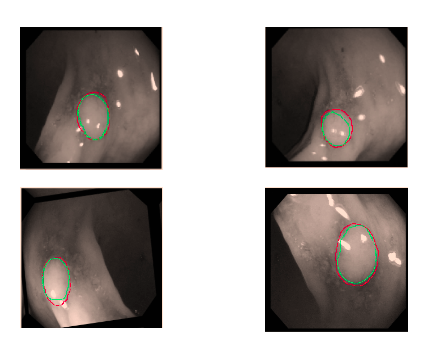

# Meta-Learning-Seg
Optmization based meta -Learning has been applied in medical setting to perform segmentation. It can be a significant method to tackle the data scarcity problem in medical domain. This repo. contains code  related to my master thesis project. The pre-trained weights of Unet model trained on brain MRI images were used to initialize the model ; which is a open source available at https://pytorch.org/hub/mateuszbuda_brain-segmentation-pytorch_unet/,thanks to "mateuszbuda" .

# Data

Dataset used are publicly available  on /multimediaeval.github.io/editions/2020/tasks/medico/ and https://polyp.grand-challenge.org/Databases/.  It consists of images of polyps in GI tract and their corresponding masks. Tasks for meta-learning were generated from the available data sources.

# Run
srun meta.sh

# Result
Empirical results were obtained by meta-training on N way k shot tasks from three different dataset and tested on the held out fourth dataset. The best dice score was obtained by training with 20 tasks under 3 way 10 shot  scheme.

 |        Task            |  Dice score |
 
 | 3-way  10=shot  |   75.54 %   |

 ## Sample predictions(Red) over groundtruth(Green)

 
